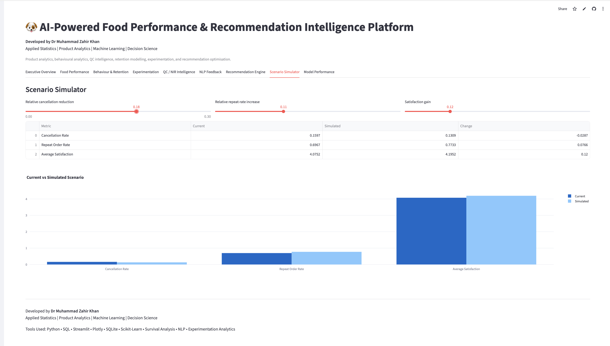

# AI-Powered Food Performance & Recommendation Intelligence Platform

## Dashboard Preview

### Executive Overview


---

### Recommendation Engine


---

### NLP Feedback Intelligence


---

### Scenario Simulator


---

## Live Demo

https://ai-food-performance-platform.streamlit.app

---

## Project Overview

AI-powered food performance, behavioural analytics, experimentation, recommendation optimisation, QC intelligence, and decision intelligence platform built using Python, SQL, Streamlit, Plotly, and machine learning.

Developed by Dr Muhammad Zahir Khan

Applied Statistics | Product Analytics | Machine Learning | Decision Science

---

## Main Features

- Executive KPI dashboard
- Food performance intelligence
- Behavioural retention analytics
- Recommendation optimisation engine
- Experimentation evaluation
- QC / NIR manufacturing intelligence
- NLP feedback intelligence
- Scenario simulation
- Machine learning model evaluation

---

## Technology Stack

- Python
- SQL / SQLite
- Streamlit
- Plotly
- Pandas
- Scikit-learn

---

## Run Locally

Install requirements:

```bash
pip install -r requirements.txt
